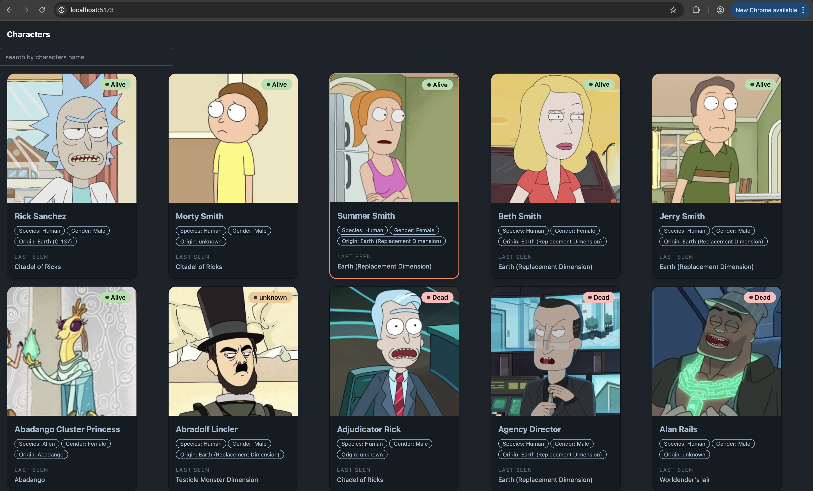
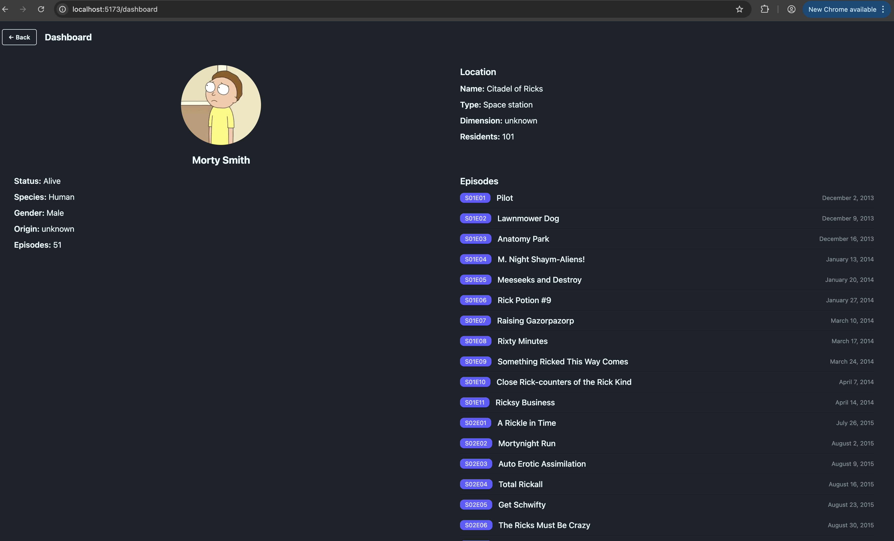
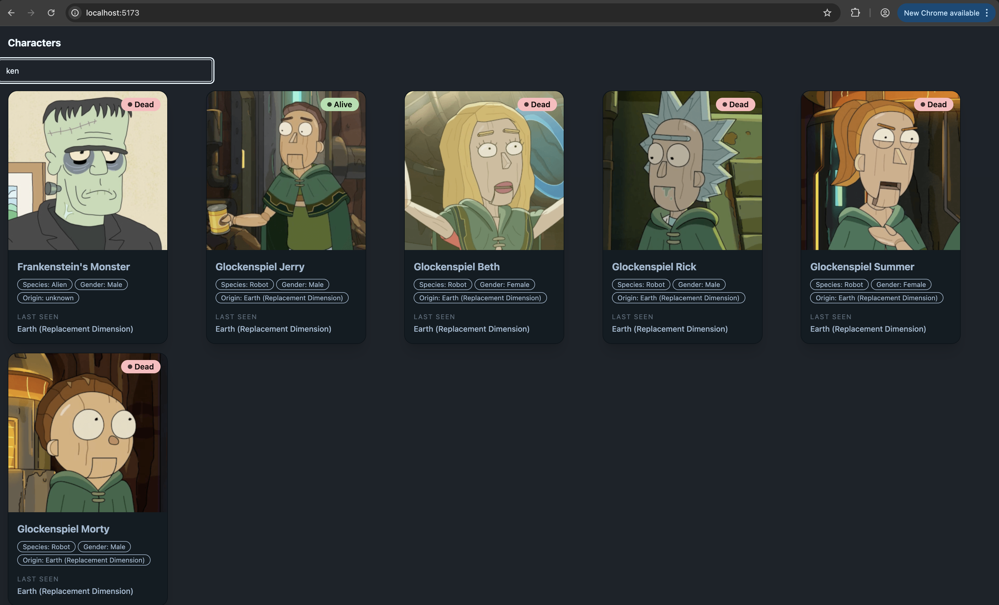

# Rick & Morty Dashboard

A React dashboard built with TanStack Query and Zustand that lets you browse Rick & Morty characters, and view their location and episode details.

## Tech Stack

- **React** + **TypeScript** + **Vite**
- **TanStack Query** — server state management and data fetching
- **Zustand** — client state management
- **DaisyUI** + **Tailwind CSS** — styling
- **React Router** — client-side routing
- **Rick & Morty API** — https://rickandmortyapi.com

## Features

- Browse all characters with search by name and paginated results
- Click any character to navigate to a detail dashboard
- Dashboard displays character info, last known location, and all episodes they appeared in
- Each section manages its own state and API calls independently via Zustand slices
- Smooth pagination with `keepPreviousData` so the UI never flashes on page change

## Screenshots 
### Character Browser


### Dashboard


### Search


## Project Structure

```
src/
├── components/
│   ├── CharacterCard.tsx     # Individual character card with click handler
│   ├── DisplayData.tsx       # Character grid with search and pagination
│   ├── LocationCard.tsx      # Fetches and displays character location
│   └── EpisodeCard.tsx       # Fetches and displays all character episodes
├── pages/
│   ├── characterPage.tsx     # Page 1 — character browser
│   └── dashboardPage.tsx     # Page 2 — character detail dashboard
├── store/
│   ├── characterSlice.ts     # Zustand store for selected character
│   ├── locationSlice.ts      # Zustand store for location URL
│   └── episodeSlice.ts       # Zustand store for episode URLs
└── types/
    └── type.ts               # TypeScript interfaces for API responses
```

## State Management

Each section has its own Zustand slice created with `create`:

- **characterSlice** — stores the currently selected character
- **locationSlice** — stores the location URL extracted from the selected character
- **episodeSlice** — stores the array of episode URLs from the selected character

When a character card is clicked, all three stores update simultaneously. The `LocationCard` and `EpisodeCard` components independently read from their respective stores and trigger their own TanStack Query fetches.

## Data Flow

```
Click character card
  → setSelectedCharacter  (characterSlice)
  → setLocationUrl        (locationSlice)
  → setEpisodeUrls        (episodeSlice)
  → navigate to /dashboard

Dashboard mounts
  → LocationCard reads locationUrl → fetches location details
  → EpisodeCard reads episodeUrls → fetches all episodes in parallel
```

## Getting Started

```bash
# Install dependencies
npm install

# Start dev server
npm run dev
```

## API Reference

| Endpoint | Used for |
|---|---|
| `/api/character?page={n}&name={q}` | Paginated + searchable character list |
| `/api/location/{id}` | Location details (via URL from character response) |
| `/api/episode/{id}` | Episode details (via URLs from character response) |